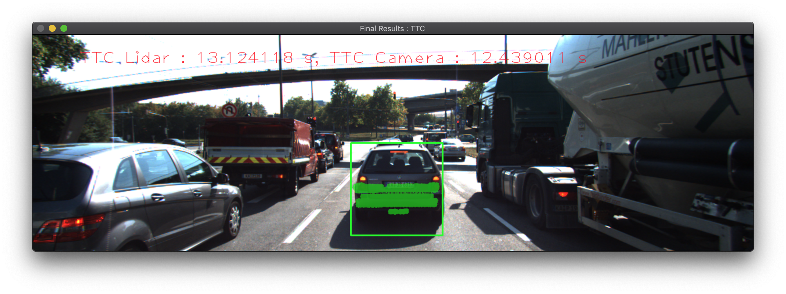
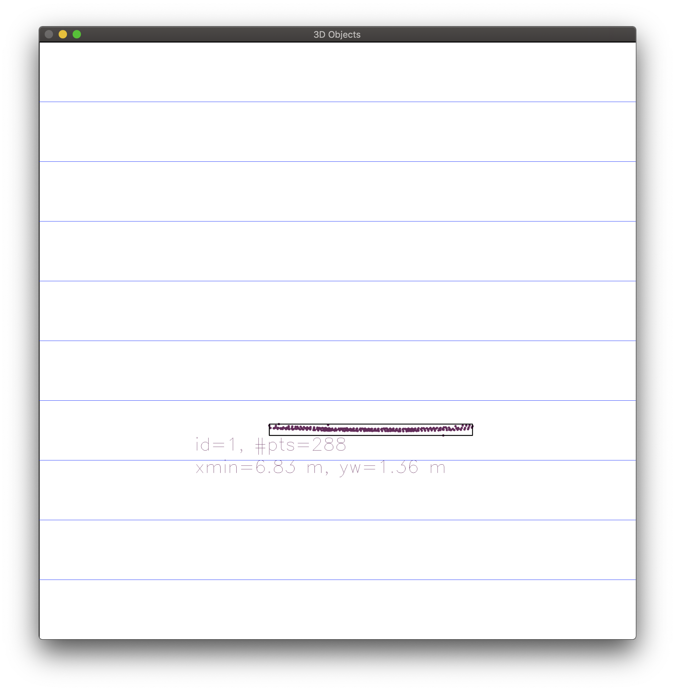
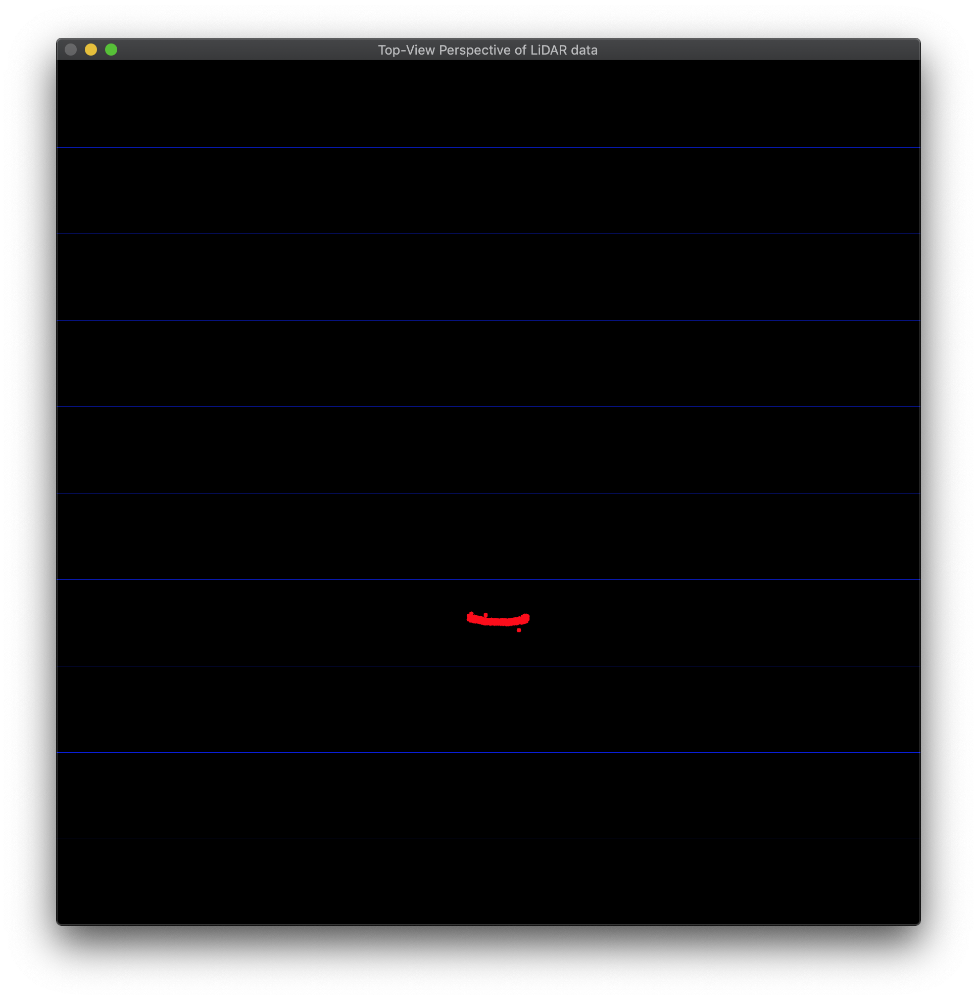
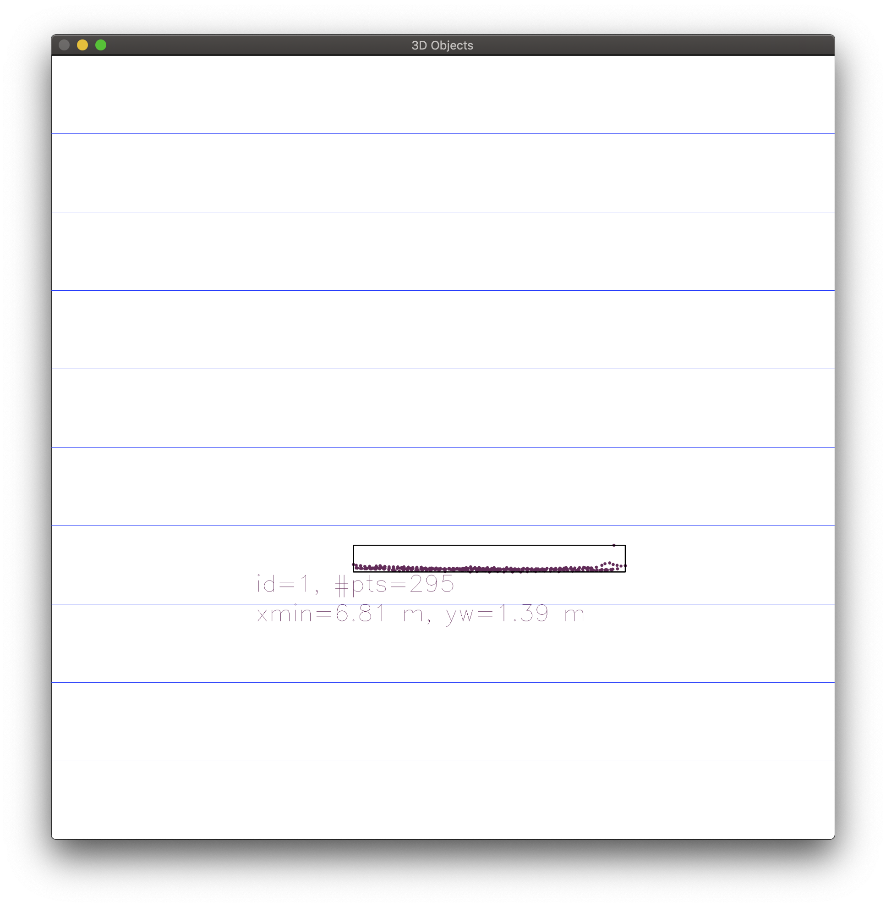
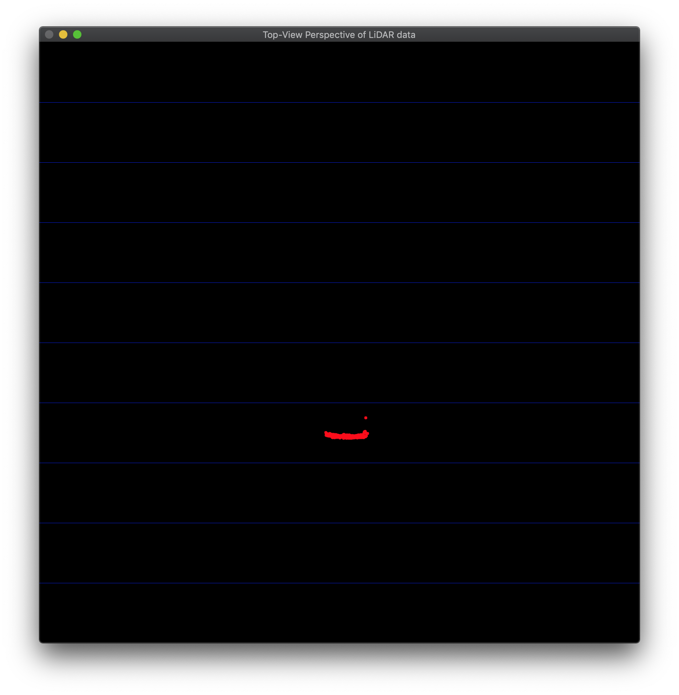
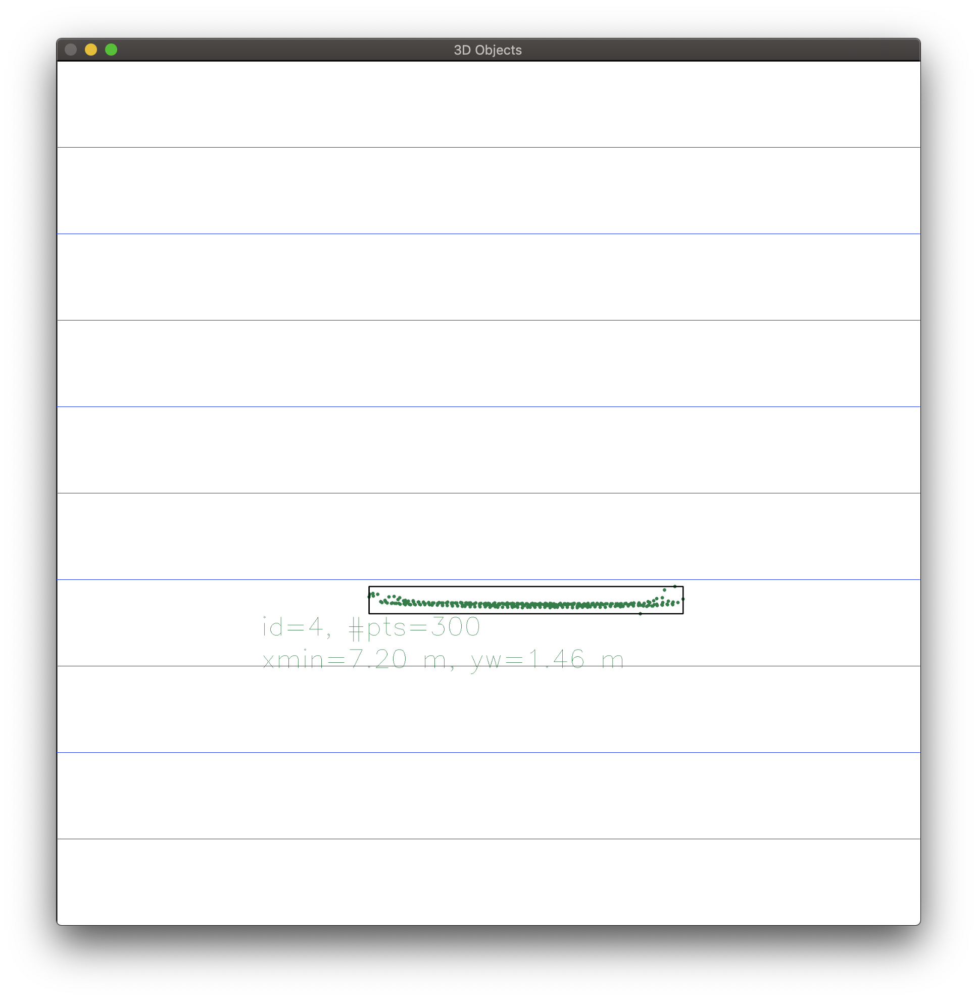
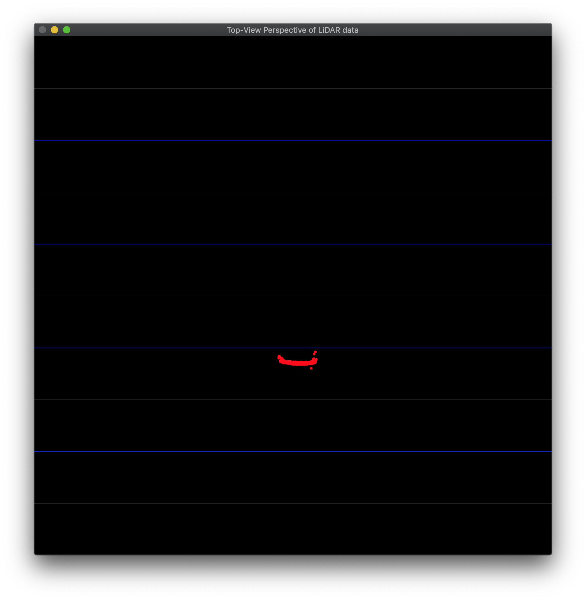
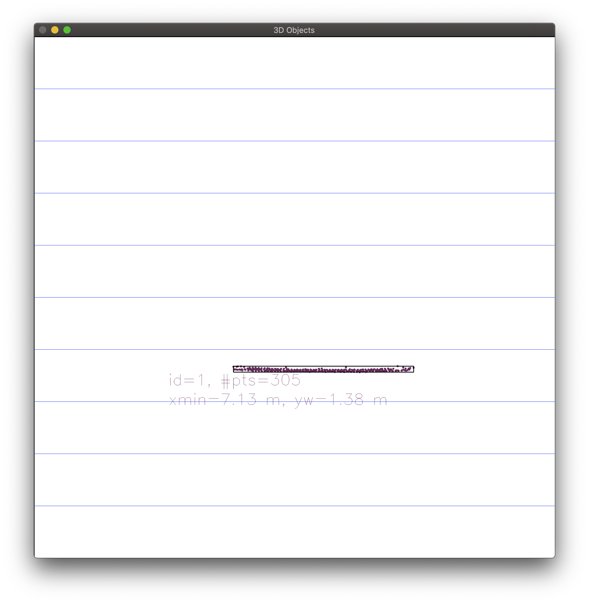

# SFND 3D Object Tracking



This is the final project for the camera unit within Udacity's Sensor Fusion Nanodegree. This project covers the following key concepts:
- Keypoint detectors and descriptors
- Methods to match keypoints between successive images
- Object detection using the pre-trained YOLO deep-learning framework
- Associating regions in a camera image with lidar points in 3D space

The flowchart below provides an overview of the final project structure. The steps in the orange box were completed in the previous project [2D Feature Tracking](https://github.com/walkerbrown/sfnd-camera-2d). This project builds on that previous one, implementing the steps in the blue box and beyond. Objects detected with the YOLO deep neural network are tracked across frames by considering the strength of keypoint correspondences within their bounding boxes. Finally, a robust estimation of time-to-collision (TTC) is performed with data from both the lidar and camera sensors.


## Dependencies
* cmake >= 2.8
  * All OSes: [click here for installation instructions](https://cmake.org/install/)
* make >= 4.1 (Linux, Mac), 3.81 (Windows)
  * Linux: make is installed by default on most Linux distros
  * Mac: [install Xcode command line tools to get make](https://developer.apple.com/xcode/features/)
  * Windows: [Click here for installation instructions](http://gnuwin32.sourceforge.net/packages/make.htm)
* Git LFS
  * Weight files are handled using [LFS](https://git-lfs.github.com/)
  * `brew install git-lfs  # Install for macOS, see link above for others`
  * `git remote add https://github.com/udacity/SFND_3D_Object_Tracking.git`
  * `git lfs install`
  * `git lfs pull upstream`
* OpenCV >= 4.1
  * This must be compiled from source using the `-D OPENCV_ENABLE_NONFREE=ON` cmake flag for testing the SIFT and SURF detectors.
  * The OpenCV 4.1.0 source code can be found [here](https://github.com/opencv/opencv/tree/4.1.0)
* gcc/g++ >= 5.4
  * Linux: gcc / g++ is installed by default on most Linux distros
  * Mac: same deal as make - [install Xcode command line tools](https://developer.apple.com/xcode/features/)
  * Windows: recommend using [MinGW](http://www.mingw.org/)

## Building and running the project
```
mkdir build && cd build
cmake ..
make
./3D_object_tracking
```

## Writeup, Task FP.0

### FP.1 Match 3D objects
_Lines 224-284 in camFusion_Student.cpp_  
As suggested, I used a `std::multimap<int,int>` to track pairs of bounding box IDs. I then counted the keypoint correspondences per box pair to determine the best matches between frames.
```
// Count the greatest number of matches in the multimap, where each element is {key=currBoxID, val=prevBoxID}
```

### FP.2 Compute lidar-based TTC
_Lines 202-221 in camFusion_Student.cpp_  
In each frame, I took the median x-distance to reduce the impact of outlier lidar points on my TTC estimate. With the constant velocity model, the key equation is as follows.
```
TTC = d1 * (1.0 / frameRate) / (d0 - d1);
```

_Lines 192-199 in camFusion_Student.cpp_  
To calculate the median, I built a helper function to sort the vector of lidar points.
```
void sortLidarPointsX(std::vector<LidarPoint> &lidarPoints)
{
    // This std::sort with a lambda mutates lidarPoints, a vector of LidarPoint
    std::sort(lidarPoints.begin(), lidarPoints.end(), [](LidarPoint a, LidarPoint b) {
        return a.x < b.x;  // Sort ascending on the x coordinate only
    });
}
```

### FP.3 Associate keypoint matches with bounding boxes
_Lines 133-142 in camFusion_Student.cpp_  
This function is called for each bounding box, and it loops through every matched keypoint pair in an image. If the keypoint falls within the bounding box region-of-interest (ROI) in the current frame, the keypoint match is associated with the current `BoundingBox` data structure.

### FP.4 Compute mono camera-based TTC
_Lines 145-189 in camFusion_Student.cpp_  
The code for this function `computeTTCCamera` drew heavily on the example provided in an earlier lesson. It uses distance ratios on keypoints matched between frames to determine the rate of scale change within an image. This rate of scale change can be used to estimate the TTC.
```
TTC = (-1.0 / frameRate) / (1 - medianDistRatio);
```
Like the lidar TTC estimation, this function uses the median distance ratio to avoid the impact of outliers. Unfortunately this approach is still **vulnerable to wild miscalculations** (-inf, NaN, etc.) if there are too many mismatched keypoints. Note also that this algorithm calculates the Euclidean distance for every paired combination of keypoints within the bounding box, `O(n^2)` on the number of keypoints.

### FP.5 Performance evaluation, lidar outliers
I was not able to find any frames where the lidar estimated TTC was unreasonable. It ranged from about 8-15 seconds. I believe the approach of taking the median point, rather than the closest point, has avoided the problem introduced by outliers. I've included some examples of the lidar top-view below.

_Figure 1, near-side outlier_  


_Figure 2, far-side outlier_  


_Figure 3, multiple outliers_  


_Figure 4, a tight group without outliers_  


### FP.6 Performance evaluation, detector/descriptor combinations
